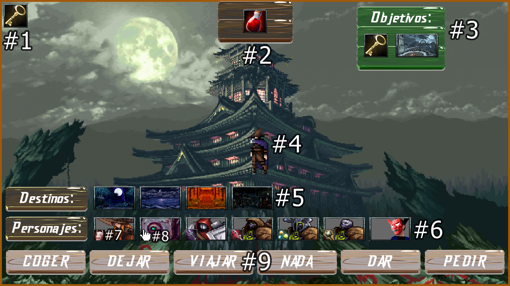

# ProyectoJava

## Miembros:
* David Villaverde
* Alejandro García
* Miguel Perez
* Guillermo Carrasco.

 

## Uso:

 Nombres permitidos 

| Personajes      | Localizaciones | Objetos  |
| :-------------  |:-------------: | -------: |
| Gunwoman        | Bambu          | Llave    |
| Robot           | Muerte         | Yelmo    |
| Knight          | Playa          | Espada   |
| Skeleton_Archer | Catedral       | Pocion   |
| Skeleton_Chief  | Cascada        | Gemas    |
| Skeleton_Normal | Castillo       | Daga     |
| King            | Cienaga        | Grimorio |
| Ninja           | Nieve          | Maza     |
| Martial         | Templo         | Medallon |
| Wizard          | Pueblo         | Anillo   |

 

## Ayuda HUD:

* #1. Objetos disponibles en la sala.
* #2. Objeto del jugador.
* #3. Objetivos del jugador.
* #4. Personaje del jugador.
* #5. Destinos disponibles.
* #6. Personajes en la sala.
* #7. Objeto del personaje.
* #8. El personaje te está pidiendo el objeto.
* #9. Botones de acción.
